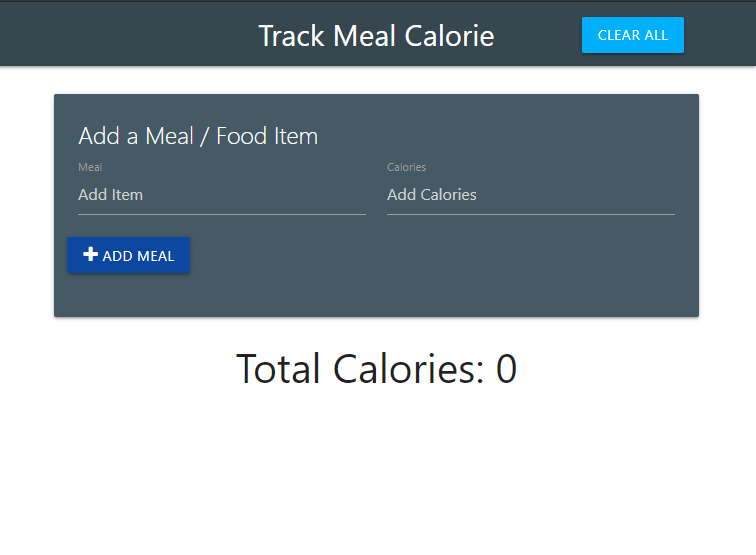
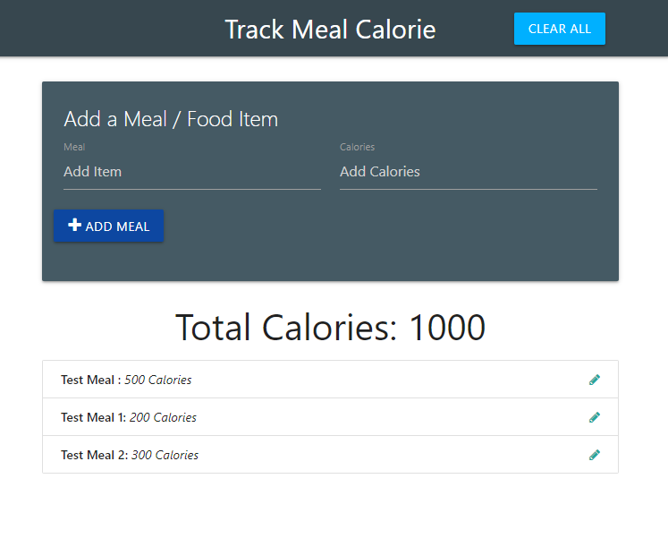
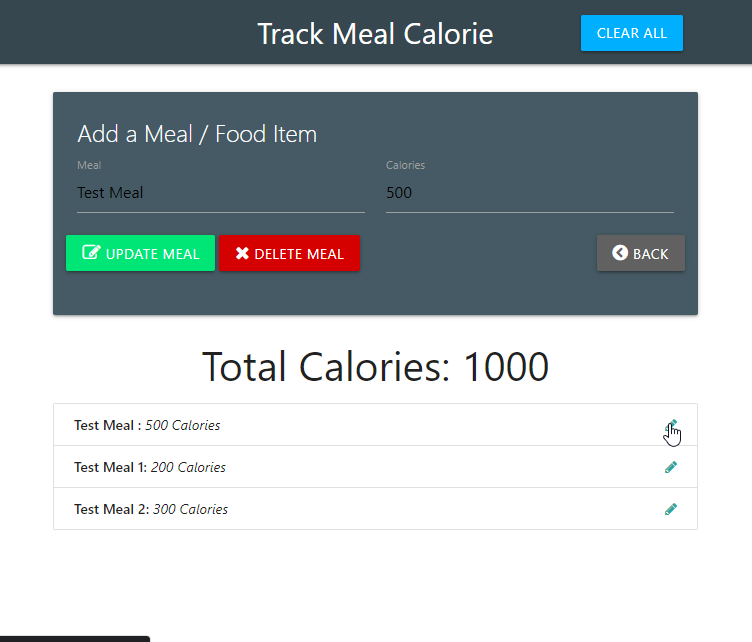

# Calorie-Tracker

This project is using vanilla JavaScript Module pattern and Materialize CSS.

I am going to create a few different module controller, an item controller to deal with the data input, an UI controller to manipulate the UI and a main app controller which will work as the intitializer.

I have to use event delegation for DOM manipulate to change the UI after the application is loaded.

Initial UI

Some Test meals added 

If we click the pencil icon then three buttons pop up in the UI

Update, Delete or do nothing with the back Button 

